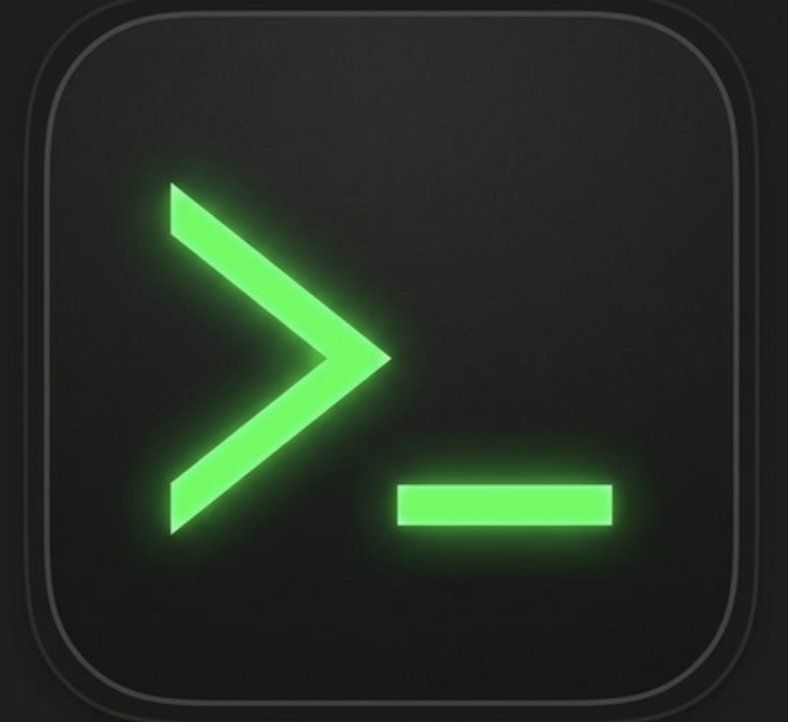

<!-- ## Star History

<a href="https://www.star-history.com/?repos=vegapunk-debug%2Fvegapunk-debug&type=date&legend=top-left">
 <picture>
   <source media="(prefers-color-scheme: dark)" srcset="https://api.star-history.com/chart?repos=vegapunk-debug/vegapunk-debug&type=date&theme=dark&legend=top-left" />
   <source media="(prefers-color-scheme: light)" srcset="https://api.star-history.com/chart?repos=vegapunk-debug/vegapunk-debug&type=date&legend=top-left" />
   
 </picture>
</a> -->

  
  

<!-- 

  

 -->

<!-- <picture>

  

</picture> -->
 

# GitHub Statistics

<table align="center" width="100%" border="0" cellspacing="0" cellpadding="2">

  <!-- Row 1: 3 equal cards (each spans 2 of 6 columns) -->
  <tr>
    <td align="center" colspan="2">
      
    </td>
    <td align="center" colspan="2">
      
    </td>
    <td align="center" colspan="2">
      
    </td>
  </tr>

  <!-- Row 2: 2 equal cards (each spans 3 of 6 columns) -->
  <tr>
    <td align="center" colspan="3">
      
    </td>
    <td align="center" colspan="3">
      
    </td>
  </tr>

  <!-- Row 3: Full width (spans all 6 columns) -->
  <tr>
    <td colspan="6" align="center">
      
    </td>
  </tr>

</table>

# Tech Stack

<table>
  <tr>
    <td align="center" width="96">
       
      <b>Python</b>
    </td> 
    <td align="center" width="96">
       
      <b>JavaScript</b>
    </td>
    <td align="center" width="96">
       
      <b>TypeScript</b>
    </td>
    <td align="center" width="96">
       
      <b>React</b>
    </td>
    <td align="center" width="96">
       
      <b>Next.js</b>
    </td>
    <td align="center" width="96">
       
      <b>HTML5</b>
    </td>
    <td align="center" width="96">
       
      <b>CSS3</b>
    </td>
  </tr>
  
  <tr>
    <td align="center" width="96">
       
      <b>Tailwind CSS</b>
    </td>
    <td align="center" width="96">
       
      <b>Framer Motion</b>
    </td>
    <td align="center" width="96">
       
      <b>Vite</b>
    </td>
    <td align="center" width="96">
       
      <b>Node.js</b>
    </td>
    <td align="center" width="96">
       
      <b>Express</b>
    </td>
    <td align="center" width="96">
       
      <b>FastAPI</b>
    </td>
    <td align="center" width="96">
       
      <b>JWT Auth</b>
    </td>
  </tr>
  <tr>
    <td align="center" width="96">
       
      <b>Mongoose</b>
    </td>
    <td align="center" width="96">
       
      <b>Prisma</b>
    </td>
    <td align="center" width="96">
       
      <b>MongoDB</b>
    </td>
    <td align="center" width="96">
       
      <b>MySQL</b>
    </td>
    <td align="center" width="96">
       
      <b>PostgreSQL</b>
    </td>
    <td align="center" width="96">
       
      <b>SQLite</b>
    </td>
    <td align="center" width="96">
       
      <b>Supabase</b>
    </td>
  </tr>
  <tr>
    <td align="center" width="96">
       
      <b>Firebase</b>
    </td>
    <td align="center" width="96">
       
      <b>Redis</b>
    </td>
    <td align="center" width="96">
       
      <b>Docker</b>
    </td>
    <td align="center" width="96">
       
      <b>AWS</b>
    </td>
    <td align="center" width="96">
       
      <b>CI/CD</b>
    </td>
    <td align="center" width="96">
       
      <b>Vercel</b>
    </td>
    <td align="center" width="96">
       
      <b>Netlify</b>
    </td>
      <!-- <td align="center" width="96">
       
      <b>Render</b> -->
    </td>
  </tr>
  <tr>
    <td align="center" width="96">
       
      <b>Linux</b>
    </td>
    <td align="center" width="96">
       
      <b>REST API</b>
    </td>
    <td align="center" width="96">
       
      <b>GitHub</b>
    </td>
    <td align="center" width="96">
       
      <b>Figma</b>
    </td>
    <td align="center" width="96">
       
      <b>Postman</b>
    </td>
    <td align="center" width="96">
       
      <b>VS Code</b>
    </td>
    <td align="center" width="96">
       
      <b>React Native</b>
    </td>
  </tr>
  <tr>
    <td align="center" width="96">
       
      <b>npm</b>
    </td>
    <td align="center" width="96">
       
      <b>Bash</b>
    </td>
    <td align="center" width="96">
       
      <b>ESLint</b>
    </td>
    <td align="center" width="96">
       
      <b>Prettier</b>
    </td>
        <td align="center" width="96">
       
      <b>Saas</b>
    </td>
    <td align="center" width="96">
       
      <b>Claude</b>
    </td>
        <td align="center" width="96">
       
      <b>Cursor</b>
    </td>
  </tr>
</table>

<!-- 

 -->

<!-- 

# Tech Stack
 <picture>
  <source media="(prefers-color-scheme: dark)" srcset="./Skills_Animation_Dark.gif">
  <source media="(prefers-color-scheme: light)" srcset="./Skills_Animation_White.gif">
  
</picture> 

 -->

<!--  -->

# Connect Me
<table align="center">
  <tr>
    <td align="center" width="70">
        
        Linkedin
    </td>
     <td align="center" width="70">
      
         Twitter
    </td>
     <td align="center" width="70">
        
          Gmail
      </td>
      <td align="center" width="70">
        
        Leetcode
    </td>
    <td align="center" width="70">
        
        Portfolio
    </td>
     
  </tr>

</table> 

  

 

---

  
# HackToberFest2025

<!-- 

  

 -->

---

<picture>

  

</picture>

---

<!-- 

 -->
